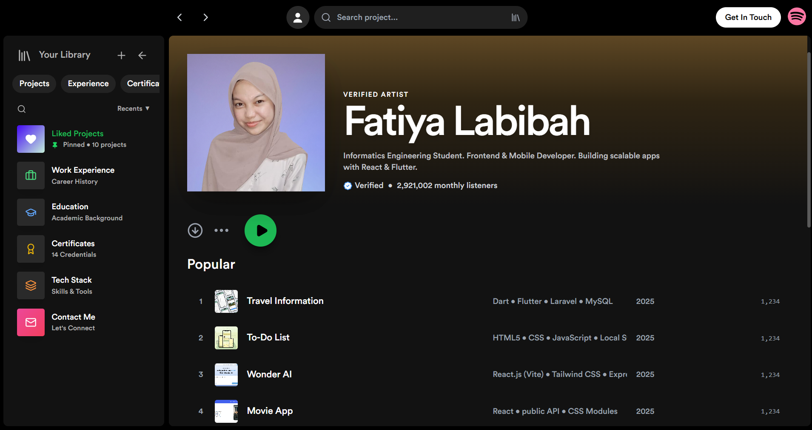

#  Fatiya Labibah - Portfolio (Spotify Style)

> A dynamic personal portfolio website inspired by Spotify's UI/UX. Built with the MERN Stack, featuring a custom Admin Dashboard, Cloudinary image optimization, and fully responsive design.




## 🎵 Live Demo
- **Frontend:** [https://fatiyalabibah.vercel.app](https://portfolio-frontend-yours.vercel.app)
- **Backend API:** [https://portfolio-be-five-dun.vercel.app](https://portfolio-be-five-dun.vercel.app)


## ✨ Key Features

### 🦊 User Interface (Frontend)
- **Spotify-inspired Design:** Dark mode aesthetic, sidebar navigation, and familiar layout.
- **Responsive:** Fully optimized for Desktop, Tablet, and Mobile devices.
- **Dynamic Content:** Projects, Education, Experience, and Certificates are fetched directly from the database.
- **Interactive Player Bar:** "Share Project" functionality (Copy Link, WhatsApp, LinkedIn).
- **Deep Linking:** Share specific projects via URL (e.g., `/?id=xyz`), which automatically opens the details sidebar.
- **Smart Sidebar:** Remembers user preference (collapsed/expanded) using Local Storage.

### 🦉 Administrator (Backend & CMS)
- **Secure Admin Panel:** Login system to manage portfolio content.
- **CRUD Operations:** Create, Read, Update, and Delete projects, certificates, etc.
- **Image Optimization:** Integrated with **Cloudinary** for fast image loading and efficient storage.
- **Database:** Hosted on **MongoDB Atlas** for real-time data access.

## ♟️ Tech Stack

| Area | Technologies |
| :--- | :--- |
| **Frontend** | React.js, Vite, Tailwind CSS, Framer Motion, Axios, Lucide React |
| **Backend** | Node.js, Express.js |
| **Database** | MongoDB Atlas (Mongoose ODM) |
| **Storage** | Cloudinary (Image CDN) |
| **Deployment** | Vercel (Frontend & Backend) |

## ⚙️ Installation & Setup (Local)

Follow these steps to run the project locally on your machine.

### Prerequisites
- Node.js (v16+)
- NPM or Yarn
- MongoDB Atlas Account
- Cloudinary Account

### 1. Clone Repository
```bash
git clone [https://github.com/your-username/repo-name.git](https://github.com/your-username/repo-name.git)
cd repo-name

```

### 2. Backend Setup

Navigate to the server folder and install dependencies.

```bash
cd server
npm install

```

Create a `.env` file inside the `server/` directory and add the following configuration:

```env
PORT=5000
MONGO_URI=mongodb+srv://<username>:<password>@cluster.mongodb.net/spotify_portfolio_db?appName=Cluster0
ADMIN_PASSWORD=your_secret_admin_password

# Cloudinary Config
CLOUDINARY_CLOUD_NAME=your_cloud_name
CLOUDINARY_API_KEY=your_api_key
CLOUDINARY_API_SECRET=your_api_secret

```

Start the server:

```bash
npm start
# Server runs at http://localhost:5000

```

### 3. Frontend Setup

Open a new terminal, navigate to the frontend folder (root).

```bash
# Assuming frontend is in the root directory
npm install

```

Ensure your API configuration in `src/api/axiosConfig.js` (or wherever you define Axios) points to localhost during development, or configure it via `.env`.

Start the frontend:

```bash
npm run dev
# Website runs at http://localhost:5173

```

---

## 🔗 API Endpoints

The backend provides a RESTful API for the frontend.

| Method | Endpoint | Description |
| --- | --- | --- |
| **POST** | `/api/login` | Admin authentication |
| **GET** | `/api/projects` | Get all projects |
| **POST** | `/api/projects` | Create new project (Image uploaded to Cloudinary) |
| **PUT** | `/api/projects/:id` | Update project |
| **DELETE** | `/api/projects/:id` | Delete project |
| **GET** | `/api/certificates` | Get all certificates |
| ... | ... | *(Same patterns for Education, Experience, Skills)* |

---

## ☁️ Deployment Guide

This project is configured for deployment on **Vercel**.

### Backend Deployment

1. Push the `server` folder to GitHub.
2. Ensure `vercel.json` exists in the backend root folder:
```json
{
  "version": 2,
  "builds": [{"src": "index.js", "use": "@vercel/node"}],
  "routes": [{"src": "/(.*)", "dest": "index.js"}]
}

```


3. Import the project into Vercel.
4. Add all **Environment Variables** (`MONGO_URI`, `CLOUDINARY_...`, etc.) in the Vercel project settings.

### Frontend Deployment

1. Push the frontend code to GitHub.
2. Ensure `vercel.json` exists in the frontend root to handle React routing (SPA):
```json
{
  "rewrites": [{"source": "/(.*)", "destination": "/index.html"}]
}

```


3. Import the project into Vercel.
4. Deploy!

---

## 🪶 Credits

Developed by **Fatiya Labibah**.

* **Design Inspiration:** Spotify
* **Icons:** Lucide React
* **Fonts:** Circular Std (Spotify Font)

---

⭐ **Don't forget to star this repo if you find it useful!**
---

*© 2025 WonderAI Project. All Rights Reserved.*